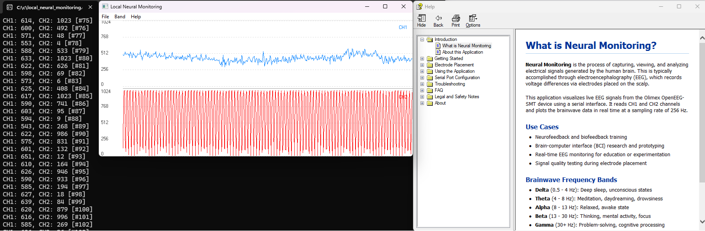

# Local Neural Monitoring

**Local Neural Monitoring** is a native Windows application written in C for real-time EEG signal visualization. It is designed to interface with the [Olimex EEG-SMT device](https://www.olimex.com/Products/EEG/OpenEEG/) over a serial connection (COM3) and display two EEG channels with a smooth waveform plot. The device is physically plugged in the USB port and merely displays as COM3.

## 🗃️ Release
- [0.0.1](https://github.com/michaloblastni/local-neural-monitoring/releases/tag/0.0.1)

## ✅ Features

- 📡 Real-time visualization of EEG data from Olimex OpenEEG-SMT (CH1 and CH2)
- ⚙️ Direct serial communication at 57600 baud
- 📉 Double-buffered chart rendering using GDI for smooth plotting
- 🧠 Visual distinction between CH1 and CH2 with labeled axes
- 🧼 Handles dropped packets and reports counter gaps
- 🧰 Startup check to optionally disable Windows serial mouse driver if active
- 🧾 Help menu with “About” and optional `.chm` file support

## 🧪 Requirements

- Windows (tested on Windows 10/11)
- [Olimex EEG-SMT device](https://www.olimex.com/Products/EEG/OpenEEG/) connected via USB
- Device mapped to `COM3` (can be changed in source code)
- FTDI VCP driver installed: [ftdichip.com](https://www.ftdichip.com/Drivers/VCP.htm)

## 🧭 Getting Started

1. If you are a developer, build the application using a C compiler for Windows, i.e. [MINGW](https://sourceforge.net/projects/mingw/). Otherwise, use the provided .exe.
2. Connect your OpenEEG-SMT device via USB and ensure it appears as `COM3`.
3. Run the application. The EEG waveform will update in real time.
4. Optionally place a `help.chm` file in the application folder to enable Help → Contents.

## 📂 File Overview

- `local_neural_monitoring.c` – Core application code (UI, serial I/O, plotting)
- `help.chm` *(optional)* – Local help file, opened from the Help menu

## 📜 License

MIT License © 2025 Michal Oblastni

This project is experimental and not intended for medical use.
