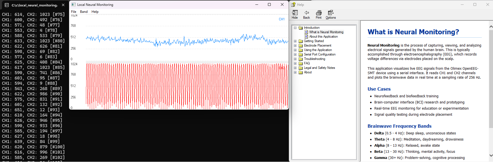

# Local Neural Monitoring 0.3.0

**Local Neural Monitoring** is a simple application that monitors and records your neural activity at home. It works with the [Olimex EEG-SMT device](https://www.olimex.com/Products/EEG/OpenEEG/EEG-SMT/open-source-hardware) and now also supports **[OpenBCI 32bit 8ch](https://www.reddit.com/r/TargetedIndividSci/comments/1mm3s4c/openbci_32bit_8_channels_at_a_low_cost/)**. The application shows your neural activity in real time, allows you to filter alpha waves, beta waves, and other brainwave bands, and lets you record your neural activity for later analysis in a Jupyter notebook.

## 🗃️ Releases
- [0.3.0 for Windows](https://github.com/michaloblastni/local-neural-monitoring/releases/tag/0.3.0) - adds support for [OpenBCI 32bit 8ch](https://www.reddit.com/r/TargetedIndividSci/comments/1mm3s4c/openbci_32bit_8_channels_at_a_low_cost/)
- [0.0.1 Alpha for Android](https://github.com/michaloblastni/local-neural-monitoring-android)
- [0.2.1 Alpha for Linux](https://gist.github.com/michaloblastni/08534a2bfb258f35e1bfebf73c34efaf) - same functions as 0.2.0 for Windows
- [0.2.0 for Windows](https://github.com/michaloblastni/local-neural-monitoring/releases/tag/0.2.0)
- [0.1.1 for Windows](https://github.com/michaloblastni/local-neural-monitoring/releases/tag/0.1.1)
- [0.0.1 for Windows](https://github.com/michaloblastni/local-neural-monitoring/releases/tag/0.0.1)

## ✅ What it does

- 📡 Neural monitoring from supported devices, including Olimex EEG-SMT and [OpenBCI 32bit 8ch](https://www.reddit.com/r/TargetedIndividSci/comments/1mm3s4c/openbci_32bit_8_channels_at_a_low_cost/)
- 📊 Lets you focus on specific brainwave types (Alpha, Beta, Gamma, Delta, Theta)
- 💾 Can save your neural activity to a file (CSV format)
- 🧾 Help menu for complete beginners who are new to neural monitoring
- ⚙️ Direct serial communication with supported devices
- 🧰 Startup check to automatically fix the crazy mouse issue
- 📉 Double-buffered chart rendering using GDI for smooth plotting
- 🧠 Visual distinction between channels with labeled axes
- 🧼 Handles dropped packets and reports counter gaps

## 🧪 Requirements

- A Windows 10 or 11 computer
- **One of these supported EEG devices:**
  - **Option 1: Olimex EEG-SMT setup**
    - [Olimex EEG-SMT device](https://www.olimex.com/Products/EEG/OpenEEG/EEG-SMT/open-source-hardware)
    - 4x Active Sensor [EEG-AE](https://www.olimex.com/Products/EEG/Electrodes/EEG-AE/open-source-hardware)
    - 1x Passive Sensor [EEG-PE](https://www.olimex.com/Products/EEG/Electrodes/EEG-PE/open-source-hardware)
    - 1x USB Cable [CABLE-USB-A-B-1.8M](https://www.olimex.com/Products/Components/Cables/USB/CABLE-USB-A-B-1.8M/)
    - On Windows, install this driver so your computer can recognize the device (Windows Universal X64): [ftdichip.com](https://www.ftdichip.com/Drivers/VCP.htm)
  - **Option 2: [OpenBCI 32bit 8ch](https://www.reddit.com/r/TargetedIndividSci/comments/1mm3s4c/openbci_32bit_8_channels_at_a_low_cost/)**

Total hardware cost: **143 EUR** *(for the Olimex EEG-SMT setup listed above)*

## How to use professional electrodes with EEG-SMT
[https://www.olimex.com/forum/index.php?topic=9856.0](https://www.olimex.com/forum/index.php?topic=9856.0)

## 🧭 How to start (even if you're not a developer)

1. Download the .exe from the latest release
2. Plug the supported device into a USB port
3. Run the application and you will see your EEG waveform updated in real time
4. See Help → Contents to learn the basics
5. Filter brainwave type using the Band menu if you want to investigate some specific neural activity
6. Press File → Start recording / Stop recording if you want to record your neural activity into a file

Once you become proficient by reading the Help and experimenting with the device, you can also use it with more advanced software such as Electric Guru, OpenViBE, and BrainBay.

## 📂 File Overview for developers
- `Makefile` - Makefile for MINGW
- `local_neural_monitoring.c` – Core application code (UI, serial I/O, band filtering, plotting)
- `serial.c` - stopping serial
- `recording.c` - EEG data recording (CSV file format)
- `help.chm` *(optional)* – Local help file, opened from the Help menu

## 📜 License

MIT License © 2025-2026 Michal Oblastni

This project is experimental and not intended for medical use.
